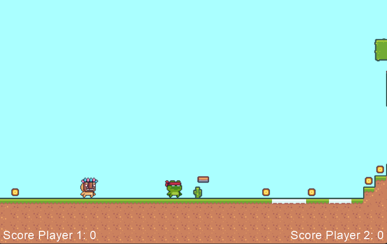

# CoinCollector

Python multiplayer platformer using the [Python Arcade](https://api.arcade.academy/en/latest/) library for game mechanics and [Python Banyan](https://mryslab.github.io/python_banyan/#) library for multiplayer implementation.

The game can be played in singleplayer or multiplayer modes, using both keyboard and joystick.

> [!NOTE]
> A running instance of a Banyan broker is necessary for the multiplayer functionalities.

